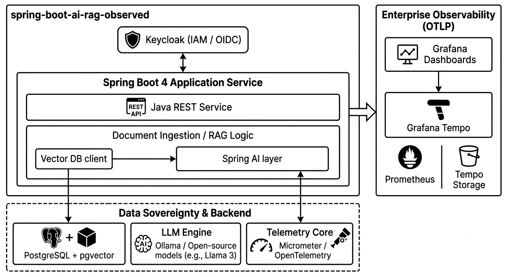

# spring-boot-ai-rag

  

## ⚡ Executive Summary

The **spring-boot-ai-rag** repository is a blueprint for a stateless Java REST service. It demonstrates how to bridge the gap between enterprise security standards, local Large Language Models (LLMs), and cloud-native observability.

### 🛑 Repository Role: Single-Service Showcase

This blueprint proves that cutting-edge AI capabilities (Retrieval-Augmented Generation) do not require sacrificing enterprise telemetry or strict access control.

* **Status:** 🚧 Work in Progress
* **Goal:** Demonstrating a zero-cloud, 100% data-sovereign AI assistant that is fully auditable and enterprise-secured from day one.

## 🔍 Key Feature: Enterprise-Grade Observability

In corporate environments, deploying AI solutions fails most frequently due to a lack of operational visibility. This architecture explicitly addresses this by treating LLM interactions not as isolated HTTP requests, but as **traceable enterprise transactions**.

### The Value Proposition

For platform engineers, security officers, and developers, this blueprint transforms opaque AI endpoints into **transparent, metrics-driven microservices**. Every embedding generation and prompt inference is fully tracked across the entire lifecycle.

### 🛠️ Telemetry & Monitoring Layers

Through the tight integration of **Spring Actuator, Micrometer, OpenTelemetry (OTLP), and the Grafana Stack**, the architecture captures:

* **Semantic Search Tracing:** Precise latency profiling of the Vector DB similarity search versus the actual LLM generation time, visualized end-to-end via **Grafana Tempo**.
* **Token & Resource Metrics:** Real-time tracking of token throughput, model response times, and connection pooling metrics exported directly to Prometheus and visualized in **Grafana Dashboards**.
* **Stateless Security Auditing:** Instant identification of unauthorized or privilege-escalation attempts at the REST barrier via JWT validation logs.

### 🎯 Strategic Impact

* **Production Readiness:** Provides operational metrics required for modern Site Reliability Engineering (SRE) practices.
* **Cost & Performance Profiling:** Enables engineers to benchmark different local models (via Ollama) against database retrieval speeds to eliminate system bottlenecks.
* **Regulatory Compliance:** Ensures full compliance with data-governance standards by proving exactly *where* data was processed and *who* requested it.

> **Architecture Note:** By routing all local LLM traffic through a structured Spring AI layer, application logic is decoupled from the underlying model infrastructure while keeping the runtime footprint predictable.

## 🏗️ Technical Stack

**Data Sovereignty**, **Stateless Security**, and **Full System Visibility** are prioritized.

### Core Technologies

| Category | Technology | Rationale                                                                                                                           |
| --- | --- |-------------------------------------------------------------------------------------------------------------------------------------|
| **Framework** | **Spring Boot 4.x (MVC)** | Next-generation, cloud-native Java platform with optimized runtime footprint and enhanced native support.                           |
| **AI Integration** | **Spring AI (Ollama Starter)** | Clean abstraction layer; allows swapping cloud APIs with local Ollama targets seamlessly.                                           |
| **Local LLM Engine** | **Ollama** | Lightweight, container-friendly inference engine running open-source models (like Llama 3 or Mistral) locally without data leakage. |
| **Vector Database** | **PostgreSQL + pgvector** | Combines rock-solid relational ACID compliance with high-performance vector similarity search.                                      |
| **IAM & Security** | **Keycloak (OAuth2 / OIDC)** | Externalized identity management, securing REST endpoints via stateless JWT verification.                                           |
| **Observability (Backend)** | **Micrometer + OpenTelemetry** | Native metric collection and distributed tracing exported via standard OTLP protocols.                                              |
| **Observability (UI/Storage)** | **Grafana + Tempo** | Grafana Dashboards for real-time metric visualization and Grafana Tempo for high-scale, low-dependency distributed trace analysis.  |

---

## ⚖️ Architectural Decisions and Strategy

#### Why Spring AI with Ollama?

I evaluated native Python-based wrappers (LangChain/LlamaIndex) but chose Spring AI to leverage native Java ecosystem patterns:

* **Decoupled Infrastructure:** Ollama provides a highly efficient local API. By pointing Spring AI's configuration to the local Ollama instance, we can switch from a free, local development model to an enterprise-grade cloud LLM via a single line in an `application.yml` profile.
* **Type Safety & Maintainability:** Java's type system ensures robust data mapping when handling document ingestion, embedding transformations, and chat client prompts.

#### Why Keycloak for a Pure REST Service?

I deliberately chose Keycloak over simple In-Memory or basic auth security architectures:

* **Stateless RBAC (Role-Based Access Control):** In RAG applications, data isolation is critical. Keycloak allows implementing strict role separations: `ROLE_USER` is permitted to query the REST endpoint, while `ROLE_ADMIN` holds exclusive rights to trigger the data ingestion pipeline into the Vector DB.
* **Resource Server Pattern:** The Spring Boot service remains completely stateless, merely validating incoming cryptographically signed Bearer JWTs, drastically reducing memory overhead.

#### Why pgvector over dedicated NoSQL Vector DBs?

I chose `pgvector` to prioritize operational simplicity and resource efficiency:

* **Unified Data Model:** Consolidating standard application metadata and high-dimensional vector embeddings into a single database technology eliminates the overhead of managing separate database clusters.
* **Production Footprint:** For localized or edge-deployed setups, a single PostgreSQL container consumes significantly fewer resources than heavy distributed NoSQL search engines.

#### Why Grafana and Tempo over standard application logging?

* **Visualized Performance Bottlenecks:** High-dimensional vector lookups combined with token generation introduce unique latency variables. Exporting these transactions via OTLP to **Grafana Tempo** makes performance debugging highly visual.
* **Unified Telemetry Dashboarding:** By leveraging **Grafana Dashboards**, platform engineers get a clear overview combining standard JVM/Spring Boot 4 metrics with deep LLM-specific token insights.

---

## 🗺️ Roadmap & Phases

- [ ] **Phase 1:** Initial project skeleton with Spring Boot 4.x
- [ ] **Phase 2:** Docker Compose setup for Local Infrastructure (Postgres, Keycloak, Grafana Stack)
- [ ] **Phase 3:** Spring AI integration with local Ollama instance
- [ ] **Phase 4:** pgvector setup
- [ ] **Phase 5:** End-to-end OTLP tracing implementation

---

## 🚀 Getting Started (Target Architecture)

> **Note:** This repository is currently a *Work in Progress*. The infrastructure components below represent the target setup.

### Prerequisites
* **Java 21** or higher
* **Docker & Docker Compose**

## 📄 License

This project is licensed under the MIT License - see the [LICENSE](LICENSE) file for details.
